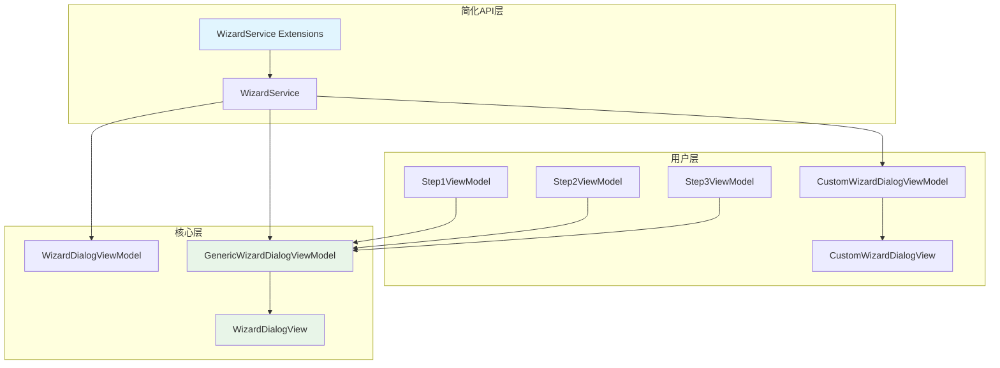

# 向导架构简化设计文档

## 概述

本设计旨在简化SmartWizard的使用方式，让开发者能够通过简单的API快速创建向导，同时保持现有的完全自定义能力。设计的核心思想是提供两种使用模式：

1. **简化模式**: 开发者只需提供步骤ViewModels，系统自动处理向导逻辑
2. **自定义模式**: 保持现有的完全自定义能力，支持特殊需求

## 架构

### 当前架构问题分析

当前架构存在以下问题：
- 用户需要创建几乎相同的WizardDialogView副本（如ConfigWizardDialogView）
- 用户需要创建简单的ViewModel继承类（如ConfigWizardViewModel）仅仅为了重写两个方法
- 大量样板代码和重复的XAML
- 学习曲线陡峭，需要理解复杂的继承关系

### 新架构设计



## 组件和接口

### 1. 扩展的IWizardService接口

```csharp
public interface IWizardService
{
    // 现有方法（保持向后兼容）
    void ShowWizard(string wizardName, IDialogParameters parameters, Action<IDialogResult> callback);
    void RegisterWizard(string wizardName, string viewName);
    
    // 新增简化方法
    void ShowWizard<TResult>(
        string title,
        IEnumerable<WizardStepViewModel> steps,
        Action<IDialogResult> callback,
        Func<IEnumerable<WizardStepViewModel>, TResult> dataCollector = null,
        WizardOptions options = null
    );
    
    void ShowWizard(
        string title,
        IEnumerable<WizardStepViewModel> steps,
        Action<IDialogResult> callback,
        WizardOptions options = null
    );
}
```

### 2. WizardOptions配置类

```csharp
public class WizardOptions
{
    public string Title { get; set; }
    public double? Width { get; set; }
    public double? Height { get; set; }
    public bool ShowStepIndicator { get; set; } = true;
    public string NextButtonText { get; set; } = "下一步";
    public string BackButtonText { get; set; } = "上一步";
    public string CancelButtonText { get; set; } = "取消";
    public string FinishButtonText { get; set; } = "完成";
    public Style WindowStyle { get; set; }
    public DataTemplate CustomStepTemplate { get; set; }
}
```

### 3. GenericWizardDialogViewModel

```csharp
public class GenericWizardDialogViewModel : WizardDialogViewModel
{
    private readonly Func<IEnumerable<WizardStepViewModel>, object> _dataCollector;
    private readonly WizardOptions _options;
    
    public GenericWizardDialogViewModel(
        IEnumerable<WizardStepViewModel> steps,
        WizardOptions options = null,
        Func<IEnumerable<WizardStepViewModel>, object> dataCollector = null,
        IEventAggregator eventAggregator = null
    ) : base(eventAggregator)
    {
        _dataCollector = dataCollector;
        _options = options ?? new WizardOptions();
        InitializeFromSteps(steps);
    }
    
    public override string Title => _options.Title ?? base.Title;
    
    protected override void InitializeSteps(IDialogParameters parameters)
    {
        // 步骤已在构造函数中初始化，这里不需要额外操作
    }
    
    protected override object CollectWizardData()
    {
        return _dataCollector?.Invoke(Steps) ?? base.CollectWizardData();
    }
    
    private void InitializeFromSteps(IEnumerable<WizardStepViewModel> steps)
    {
        foreach (var step in steps)
        {
            AddStep(step);
        }
    }
}
```

### 4. 扩展的WizardService实现

```csharp
public class WizardService : IWizardService
{
    private readonly IDialogService _dialogService;
    private readonly IContainerProvider _containerProvider;
    private readonly Dictionary<string, string> _wizardRegistry;
    
    // 现有方法保持不变...
    
    public void ShowWizard<TResult>(
        string title,
        IEnumerable<WizardStepViewModel> steps,
        Action<IDialogResult> callback,
        Func<IEnumerable<WizardStepViewModel>, TResult> dataCollector = null,
        WizardOptions options = null)
    {
        var genericDataCollector = dataCollector != null 
            ? (stepList) => dataCollector(stepList)
            : (Func<IEnumerable<WizardStepViewModel>, object>)null;
            
        ShowWizardInternal(title, steps, callback, genericDataCollector, options);
    }
    
    public void ShowWizard(
        string title,
        IEnumerable<WizardStepViewModel> steps,
        Action<IDialogResult> callback,
        WizardOptions options = null)
    {
        ShowWizardInternal(title, steps, callback, null, options);
    }
    
    private void ShowWizardInternal(
        string title,
        IEnumerable<WizardStepViewModel> steps,
        Action<IDialogResult> callback,
        Func<IEnumerable<WizardStepViewModel>, object> dataCollector,
        WizardOptions options)
    {
        options = options ?? new WizardOptions();
        options.Title = title;
        
        // 创建通用ViewModel实例
        var viewModel = new GenericWizardDialogViewModel(steps, options, dataCollector, 
            _containerProvider.Resolve<IEventAggregator>());
        
        // 创建对话框参数
        var parameters = new DialogParameters
        {
            { "ViewModel", viewModel },
            { "Options", options }
        };
        
        // 使用通用的WizardDialogView
        _dialogService.ShowDialog("WizardDialogView", parameters, callback);
    }
}
```

## 数据模型

### WizardStepViewModel增强

现有的WizardStepViewModel保持不变，但建议添加一些便利属性：

```csharp
public abstract class WizardStepViewModel : BindableBase
{
    // 现有属性保持不变...
    
    // 新增便利属性
    public virtual object Data { get; set; }
    public virtual Dictionary<string, object> Properties { get; } = new Dictionary<string, object>();
    
    // 便利方法
    public T GetProperty<T>(string key, T defaultValue = default(T))
    {
        return Properties.TryGetValue(key, out var value) && value is T typedValue 
            ? typedValue 
            : defaultValue;
    }
    
    public void SetProperty<T>(string key, T value)
    {
        Properties[key] = value;
    }
}
```

## 错误处理

### 1. 参数验证
- 验证步骤列表不为空
- 验证每个步骤都有有效的DataTemplate
- 验证标题不为空

### 2. 运行时错误处理
- 步骤验证失败的处理
- DataTemplate解析失败的处理
- 数据收集器异常的处理

### 3. 错误恢复机制
- 提供默认的错误步骤显示
- 允许跳过有问题的步骤
- 提供详细的错误日志

## 测试策略

### 1. 单元测试
- GenericWizardDialogViewModel的各种场景测试
- WizardService扩展方法的测试
- WizardOptions配置的测试

### 2. 集成测试
- 简化API与现有API的兼容性测试
- 不同步骤组合的测试
- 自定义数据收集器的测试

### 3. UI测试
- 向导界面的自动化测试
- 不同配置选项的视觉测试
- 响应式布局的测试

## 实现细节

### 1. 向后兼容性保证

现有的API完全保持不变：
- `IWizardService.ShowWizard(string, IDialogParameters, Action<IDialogResult>)`
- `IWizardService.RegisterWizard(string, string)`
- 现有的WizardDialogViewModel继承方式
- 现有的自定义View注册方式

### 2. 模块注册更新

```csharp
public class SmartWizardModule : IModule
{
    public void RegisterTypes(IContainerRegistry containerRegistry)
    {
        // 现有注册保持不变
        containerRegistry.RegisterSingleton<IWizardService, WizardService>();
        containerRegistry.Register<WizardDialogViewModel>();
        
        // 新增通用组件注册
        containerRegistry.Register<GenericWizardDialogViewModel>();
        
        // 注册通用对话框视图（如果还没有注册）
        containerRegistry.RegisterDialog<WizardDialogView, WizardDialogViewModel>("WizardDialogView");
    }
}
```

### 3. 使用示例

#### 简化方式使用：

```csharp
// 在ViewModel中
private void ShowConfigWizard()
{
    var steps = new List<WizardStepViewModel>
    {
        _containerProvider.Resolve<Step1ViewModel>(),
        _containerProvider.Resolve<Step2ViewModel>()
    };
    
    _wizardService.ShowWizard(
        "配置向导",
        steps,
        result =>
        {
            if (result.Result == ButtonResult.OK)
            {
                var data = result.Parameters.GetValue<object>("WizardResult");
                // 处理结果
            }
        }
    );
}
```

#### 带自定义数据收集器：

```csharp
_wizardService.ShowWizard<ConfigResult>(
    "配置向导",
    steps,
    result => { /* 处理结果 */ },
    stepList => new ConfigResult
    {
        Name = (stepList.First() as Step1ViewModel)?.Name,
        Email = (stepList.First() as Step1ViewModel)?.Email,
        Language = (stepList.Skip(1).First() as Step2ViewModel)?.SelectedLanguage
    }
);
```

#### 自定义方式（现有方式保持不变）：

```csharp
// 仍然可以创建自定义的ViewModel和View
public class CustomWizardViewModel : WizardDialogViewModel
{
    // 自定义实现
}

// 注册和使用方式完全不变
_wizardService.ShowWizard("CustomWizard", parameters, callback);
```

这个设计确保了：
1. 简单场景下的易用性大大提升
2. 复杂场景下的完全自定义能力得到保留
3. 现有代码无需修改即可继续工作
4. 新旧API可以在同一个项目中并存使用