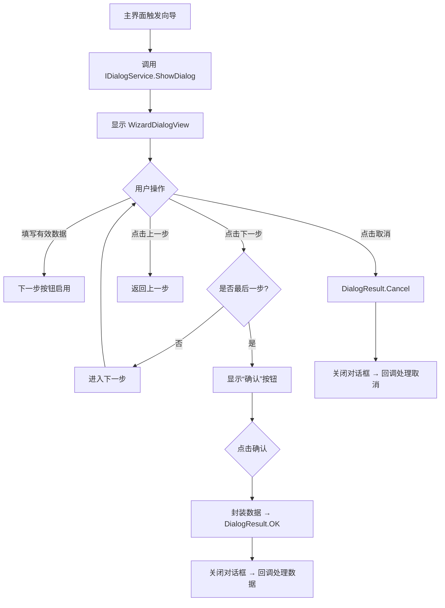

# 📄《向导控件需求与设计文档（Prism MVVM + Dialog Service 版）》

> **修订说明**：本版本在原始文档基础上，针对 **Prism 框架** 和 **Dialog Service** 的使用场景，更新了架构设计、交互方式、依赖注入、模块化等关键内容，使其更贴合 Prism 生态开发规范。

---

## 🆕 一、概述（更新）

本向导控件（Wizard Control）基于 **Prism Library for WPF** 实现，采用 **MVVM 模式** 并深度集成 **Prism Dialog Service**，用于在模态对话框中承载多步骤引导流程。控件支持动态步骤配置、导航验证、状态绑定与用户中断，所有交互通过 **IEventAggregator** 或 **Dialog Result** 与主应用通信。

> ✅ 适用场景：需要在弹窗中引导用户完成复杂操作（如配置向导、数据导入、注册流程等）  
> ✅ 技术栈：Prism 8+ / .NET 6+ / WPF / MVVM / IDialogService / IEventAggregator

---

## 🆕 二、功能需求（补充）

### 2.1 核心功能（新增/调整项）

| 功能项 | 描述 | Prism 关联 |
|--------|------|-------------|
| 对话框承载 | 向导以模态对话框形式弹出，由 `IDialogService` 统一管理生命周期 | ✅ 使用 `IDialogService.ShowDialog` |
| 步骤 ViewModel 注册 | 所有步骤 ViewModel 需注册为 `DialogWindowViewModel` 或继承自 `BindableBase` | ✅ 支持 DI 容器管理 |
| 导航命令解耦 | “下一步/确认/取消” 命令通过 `DelegateCommand` 实现，避免 View 依赖 | ✅ Prism `DelegateCommand` |
| 完成/取消结果传递 | 通过 `IDialogResult` 向调用方返回数据或状态 | ✅ `ButtonResult.OK/Cancel` + `Parameters` |
| 事件通信（可选） | 可通过 `IEventAggregator` 发布完成/取消事件，供其他模块监听 | ✅ Prism Pub/Sub 机制 |
| 模块化支持 | 向导可封装为独立 Prism Module，便于插件化部署 | ✅ `IModule` + `ViewModelLocationProvider` |

### 2.2 非功能性需求（更新）

| 类别 | 要求 | Prism 关联 |
|------|------|-------------|
| 架构 | 严格遵循 Prism MVVM，使用 `BindableBase`, `DelegateCommand`, `IDialogService` | ✅ Prism 标准组件 |
| 依赖注入 | 所有 ViewModel、Service 通过 `IServiceProvider` 或 `ContainerRegistry` 注册 | ✅ 支持 DryIoc / Unity |
| 可测试性 | ViewModel 可注入 Mock DialogService / EventAggregator，便于单元测试 | ✅ 接口抽象 + Mock |
| 可扩展性 | 支持通过 `CompositePresentationEvent<T>` 扩展步骤间通信 | ✅ Prism EventAggregator |
| 主题/区域 | 可选支持 Prism Region 管理步骤内容（高级用法） | ⚠️ 可选增强 |

---

## 🆕 三、界面设计规范（无变更）

> 💡 界面布局、按钮行为、状态反馈等交互规范保持不变，仅底层实现机制调整。

---

## 🆕 四、架构设计（重大更新）

### 4.1 类结构图（Prism 风格）

```plaintext
WizardDialogViewModel : DialogWindowViewModel (或 BindableBase + IDialogAware)
├── Title: string (IDialogAware)
├── Steps: ObservableCollection<WizardStepViewModel>
├── CurrentStepIndex: int
├── CurrentStep: WizardStepViewModel
├── CanGoBack: bool
├── CanGoNext: bool
├── IsLastStep: bool
├── NextButtonText: string
├── RequestClose: IDialogResult → 用于关闭对话框并返回结果
├── EventAggregator: IEventAggregator (可选)
├── GoBackCommand: DelegateCommand
├── GoNextCommand: DelegateCommand
├── CancelCommand: DelegateCommand
└── OnDialogOpened(IDialogParameters parameters) → 初始化数据

WizardStepViewModel : BindableBase
├── Title: string (abstract)
└── IsValid: bool (abstract)

Step1ViewModel : WizardStepViewModel
Step2ViewModel : WizardStepViewModel
...
```

### 4.2 数据绑定关系（不变）

> 与原始文档一致，但 ViewModel 需实现 `IDialogAware` 接口。

### 4.3 Prism 专属设计

#### ▶ 对话框启动方式

```csharp
// 在主 ViewModel 中调用
_dialogService.ShowDialog("WizardDialogView", parameters, result =>
{
    if (result.Result == ButtonResult.OK)
    {
        var collectedData = result.Parameters.GetValue<WizardResult>("ResultData");
        // 处理完成数据
    }
});
```

#### ▶ WizardDialogViewModel 实现 IDialogAware

```csharp
public class WizardDialogViewModel : BindableBase, IDialogAware
{
    public string Title => "配置向导";

    public event Action<IDialogResult> RequestClose;

    public void OnDialogOpened(IDialogParameters parameters)
    {
        // 初始化步骤数据
        InitializeSteps();
    }

    private void FinishWizard()
    {
        var result = new DialogResult(ButtonResult.OK, new DialogParameters
        {
            { "ResultData", new WizardResult { Name = ..., Age = ... } }
        });
        RequestClose?.Invoke(result);
    }

    private void CancelWizard()
    {
        RequestClose?.Invoke(new DialogResult(ButtonResult.Cancel));
    }
}
```

#### ▶ 步骤间通信（可选 EventAggregator）

```csharp
public class WizardCompletedEvent : PubSubEvent<WizardResult> { }

// 在 WizardDialogViewModel 中发布
_eventAggregator.GetEvent<WizardCompletedEvent>().Publish(resultData);

// 在其他模块订阅
_eventAggregator.GetEvent<WizardCompletedEvent>().Subscribe(OnWizardCompleted);
```

---

## 🆕 五、交互流程图（更新调用方式）



---

## 🆕 六、验收标准（新增 Prism 相关项）

| 测试项 | 预期结果 |
|--------|----------|
| 通过 IDialogService 调用向导 | 对话框正常弹出，标题正确 |
| ViewModel 注入 EventAggregator/DialogService | 无空引用异常，依赖正确解析 |
| 点击“确认”返回 DialogResult.OK + 数据 | 主回调函数接收到有效数据 |
| 点击“取消”返回 DialogResult.Cancel | 主回调函数接收到取消信号 |
| 步骤 ViewModel 支持 DI 注入 | 可注入服务（如 ILogger、IRepository） |
| 单元测试中 Mock IDialogService | 可验证命令调用和参数传递 |

---

## 🆕 七、附录（更新）

### 7.1 术语表（新增）

| 术语 | 说明 |
|------|------|
| `IDialogService` | Prism 提供的对话框服务，用于统一管理模态窗口 |
| `IDialogAware` | ViewModel 实现此接口以响应对话框生命周期 |
| `DialogResult` | 封装对话框关闭结果和返回参数 |
| `DelegateCommand` | Prism 命令系统，支持自动 CanExecute 刷新 |
| `IEventAggregator` | Prism 事件聚合器，用于模块间松耦合通信 |

### 7.2 Prism 专属参考资料

- [Prism Library 官方文档 - Dialog Service](https://prismlibrary.com/docs/wpf/dialog-service.html)
- [Prism GitHub 仓库](https://github.com/PrismLibrary/Prism)
- [IDialogAware 接口说明](https://prismlibrary.com/docs/wpf/dialog-service.html#idialogaware)
- [使用 EventAggregator 进行通信](https://prismlibrary.com/docs/event-aggregator.html)

---

## 🆕 八、修订记录（新增版本）

| 版本 | 日期 | 修改内容 | 作者 |
|------|------|----------|------|
| V1.0 | 2025-04-05 | 初稿完成 | AI 架构师 |
| **V2.0** | 2025-04-05 | **新增 Prism + Dialog Service 专用设计** | AI 架构师 |

---

## ✅ 总结：是否需要修改文档？

> **是的，必须修改。**

因为 Prism Dialog Service 引入了以下关键变更：

1. **生命周期管理方式不同** → 使用 `IDialogAware` + `RequestClose`
2. **结果传递机制不同** → 使用 `DialogResult` 而非事件或属性
3. **依赖注入要求** → ViewModel 必须支持容器注册
4. **命令系统标准化** → 推荐使用 `DelegateCommand`
5. **模块化/事件扩展** → 可选集成 `IEventAggregator`

---

## 📦 下一步建议

我可以为你提供：

1. ✅ **完整的 Prism 项目结构（含 Module、ViewModel、View、注册代码）**
2. ✅ **WizardDialogViewModel + 步骤 ViewModel 实现代码**
3. ✅ **主界面调用示例 + 单元测试 Mock 示例**
4. ✅ **HTML 文档的更新版（含 Prism 章节）**

请告诉我你需要哪一项，我将立即为你生成！

> 💡 推荐：如果你正在使用 Prism，强烈建议采用此方案 —— 它更规范、更易测试、更易维护。